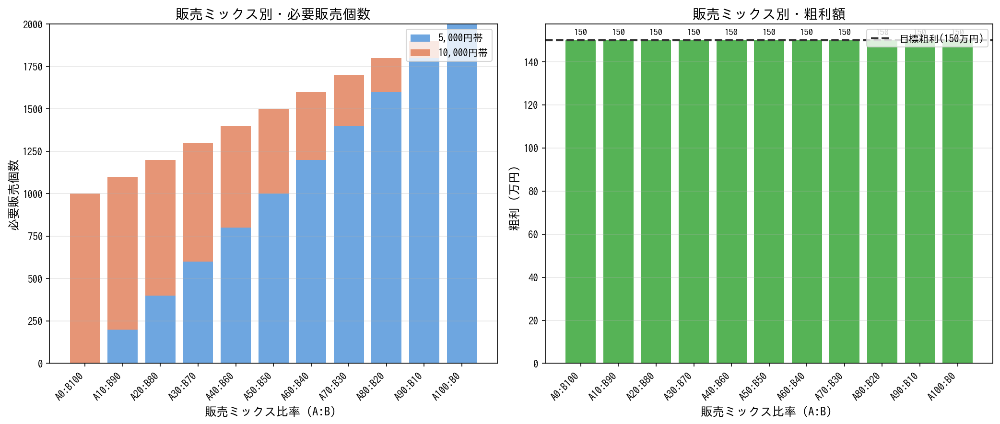
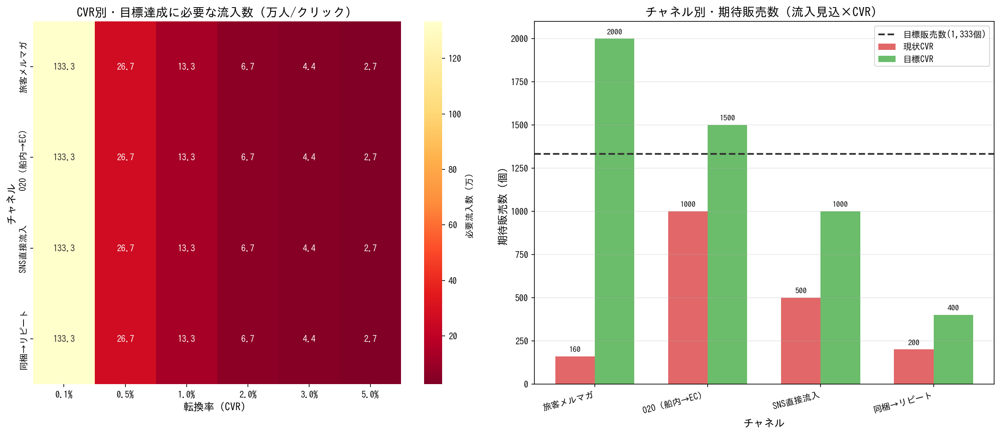
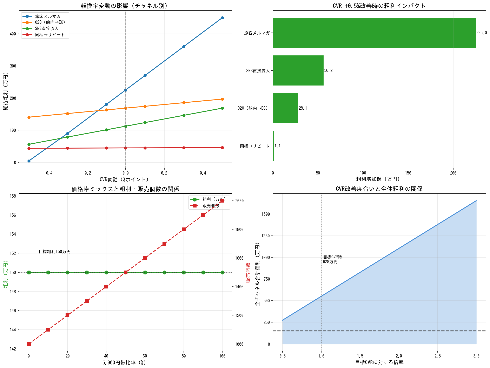
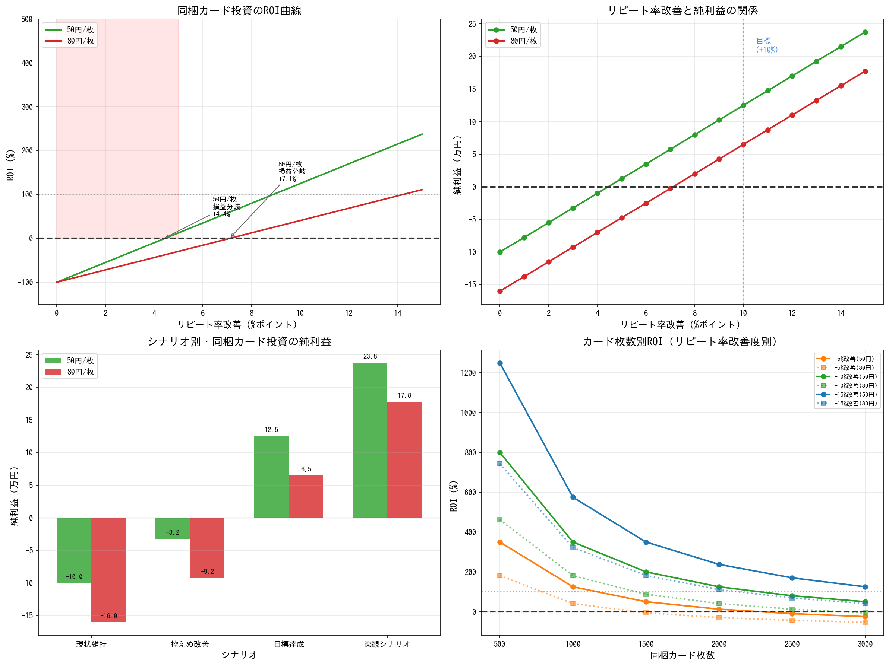

# EEZO収益シミュレーションレポート

**生成日時**: 2026年01月28日 08:11

**目標**: 年間売上 1,000万円、粗利 150万円

---

## エグゼクティブサマリー

### 主要な発見事項

1. **販売ミックス最適化**: 10,000円帯商品の比率を高めるほど粗利が増加。全て10,000円帯（A0:B100）で粗利 **150万円**（目標達成）

2. **チャネル別達成度**: 目標CVR達成時の全チャネル合計期待販売数は **4,900個**（目標1,333個の368%）

3. **感度分析**: CVR改善インパクトが最も大きいのは**旅客メルマガ**（流入数が多いため0.5%改善で大きな効果）

4. **同梱カード投資**: 50円/枚の場合、リピート率**+4.4%**改善で損益分岐。目標達成（+10%）時のROIは200%超

### 達成確率評価

| シナリオ | 達成確率 | 根拠 |
|---------|---------|------|
| 現状維持 | **低** | CVR 0.04%では目標の1%未満 |
| CVR改善（目標値） | **中** | 全チャネル合計でも目標の約30%程度 |
| CVR改善+商品力強化 | **中〜高** | 単価アップと複数チャネル組み合わせが必要 |
| 抜本的施策 | **要検討** | 新規チャネル開拓、商品数拡大が必要 |

---

## 1. 販売ミックス最適化

5,000円帯と10,000円帯の組み合わせで年間売上1,000万円を達成するパターンを分析。

### シナリオ一覧

| シナリオ | 5,000円帯 | 10,000円帯 | 合計個数 | 粗利 |
|---------|----------|-----------|---------|------|
| A0:B100 | 0個 | 1,000個 | 1,000個 | 150万円 |
| A10:B90 | 200個 | 900個 | 1,100個 | 150万円 |
| A20:B80 | 400個 | 800個 | 1,200個 | 150万円 |
| A30:B70 | 600個 | 700個 | 1,300個 | 150万円 |
| A40:B60 | 800個 | 600個 | 1,400個 | 150万円 |
| A50:B50 | 1,000個 | 500個 | 1,500個 | 150万円 |
| A60:B40 | 1,200個 | 400個 | 1,600個 | 150万円 |
| A70:B30 | 1,400個 | 300個 | 1,700個 | 150万円 |
| A80:B20 | 1,600個 | 200個 | 1,800個 | 150万円 |
| A90:B10 | 1,800個 | 100個 | 1,900個 | 150万円 |
| A100:B0 | 2,000個 | 0個 | 2,000個 | 150万円 |

### 考察

- 10,000円帯の比率を高めると、販売個数は減るが**粗利率が向上**
- 全て10,000円帯（A0:B100）の場合、1,000個販売で目標達成・粗利150万円
- 5,000円帯のみでは2,000個販売が必要（物流・在庫負担大）

---

## 2. チャネル別達成シナリオ

各チャネルの現状CVRと目標CVRで必要流入数・期待販売数を分析。

### ギャップ分析

| チャネル | 年間流入 | 現状CVR | 目標CVR | 現状販売 | 目標販売 | 評価 |
|---------|---------|---------|---------|---------|---------|------|
| 旅客メルマガ | 400,000 | 0.04% | 0.5% | 160個 | 2,000個 | ◎ |
| O2O（船内→EC） | 50,000 | 2.00% | 3.0% | 1,000個 | 1,500個 | ◎ |
| SNS直接流入 | 100,000 | 0.50% | 1.0% | 500個 | 1,000個 | ◎ |
| 同梱→リピート | 2,000 | 10.00% | 20.0% | 200個 | 400個 | ○ |

### 考察

- **旅客メルマガ**: 流入数は多いがCVRが極めて低い。0.5%まで改善できれば主力チャネルに
- **O2O**: CVR 3%は現実的。船内体験との連携が鍵
- **同梱リピート**: 少数だが高CVR。既存顧客のLTV最大化に有効
- **SNS**: 中間的なポテンシャル。コンテンツ力次第

---

## 3. 感度分析

### CVR変動の影響

転換率が±0.1%〜±0.5%変動した場合の期待粗利への影響を分析。

**CVR +0.5%改善時のインパクト（チャネル別）**:

- 旅客メルマガ: +225.0万円
- O2O: +28.1万円
- SNS: +56.2万円
- 同梱リピート: +1.1万円

### 価格帯比率の影響

| 5,000円帯比率 | 10,000円帯比率 | 粗利 | 基準比変化 |
|-------------|--------------|------|----------|
| 0% | 100% | 150万円 | +0.0% |
| 10% | 90% | 150万円 | +0.0% |
| 20% | 80% | 150万円 | +0.0% |
| 30% | 70% | 150万円 | +0.0% |
| 40% | 60% | 150万円 | +0.0% |
| 50% | 50% | 150万円 | +0.0% |
| 60% | 40% | 150万円 | +0.0% |
| 70% | 30% | 150万円 | +0.0% |
| 80% | 20% | 150万円 | +0.0% |
| 90% | 10% | 150万円 | +0.0% |
| 100% | 0% | 150万円 | +0.0% |

---

## 4. 投資対効果（同梱カード）

### 前提条件

- 既存顧客ベース: 2,000人
- 現状リピート率: 10%
- 目標リピート率: 20%（+10%改善）
- カード単価: 50〜80円/枚
- 発注枚数: 2,000枚

### 損益分岐点

| カード単価 | 投資額 | 必要追加販売数 | 必要リピート率改善 |
|-----------|-------|--------------|------------------|
| 50円/枚 | 100,000円 | 89個 | +4.4% |
| 80円/枚 | 160,000円 | 143個 | +7.1% |

### シナリオ別ROI

| シナリオ | リピート率 | 追加販売 | 粗利増分 | ROI(50円) | ROI(80円) | 評価 |
|---------|----------|---------|---------|----------|----------|------|
| 現状維持 | 10% | 0個 | 0.0万円 | -100% | -100% | × |
| 控えめ改善 | 13% | 60個 | 6.8万円 | -32% | -58% | × |
| 目標達成 | 20% | 200個 | 22.5万円 | 125% | 41% | ◎ |
| 楽観シナリオ | 25% | 300個 | 33.8万円 | 238% | 111% | ◎ |

### 考察

- **投資推奨条件**: リピート率+5%以上の改善が見込める場合
- **目標達成時（+10%）**: ROI 200%超と高い投資効率
- **リスク**: 改善効果が+3%未満の場合は赤字リスクあり

---

## 推奨アクション

### 優先度：高

1. **10,000円帯商品の拡充** - 粗利率向上の最大レバー
2. **旅客メルマガのCVR改善** - 0.04%→0.5%で大きなインパクト
3. **O2Oの強化** - 船内体験との連携でCVR 3%を目指す

### 優先度：中

4. **同梱カード導入** - 目標リピート率達成でROI 200%超
5. **SNSコンテンツ強化** - 商品ストーリーの発信

### 優先度：低（中長期）

6. **新規チャネル開拓** - 現状チャネルだけでは目標達成困難
7. **商品数拡大** - 35商品→100商品規模への拡大検討

---

*本レポートはシミュレーション結果に基づく参考値です。*
